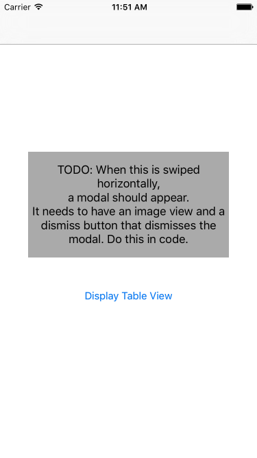

#  Assignment 3: View Controllers II

### PROMPT

**Goal**: *Build interactivity (buttons, modal views) into your application using multiple view controllers and segues.*

As you've learned in this course, you can **add multiple view controllers** to a storyboard and link them together using segues. This assignment will give you experience with several different types of view controllers and views.

With this app, you'll learn how to better use common interactive UI elements and how to add **custom gestures**. In addition, you'll use object-oriented programming principles (encapsulation, polymorphism, inheritance). Remember, methods in views and view controllers can be inherited from superclasses. Before you get started, you should have a good understanding of how views are laid out, and at a basic level, the types of views and controls that are commonly used in iOS applications.

**VIDEO:** It's a lot, but we've outlined the steps to help you to be able build what you need. You can take a look at [sample deliverable](https://youtu.be/WDMdJTsuXc4) to get started.

---

### DELIVERABLES

Your app must:

* use a Storyboard and have a gesture recognizer on ViewController,
* include a `UIImageView` in a view controller presented via a modal segue,
* perform segues using code,
* include a new class,
* store objects that can displayed in the table view, and
* follow the specific requirements and constraints below.

#### Swiping and Coding View Controllers

**Part 1**: Add a swipe gesture recognizer that presents a new view controller via a modal segue when swiped.

* In the Storyboard, add a swipe gesture recognizer to the source view controller.
* Create an `@IBOutlet` to it in the view controller's code.
* Use the `addTarget` method to enable a function to be called when the swipe occurs.
* Present the view controller via a modal segue in this function using `performSegueWithIdentifier` or by using `presentViewController` and creating a view controller with code.

**Part 2**: Customize the presented view controller.

* Add a button labeled "Dismiss" that will dismiss the view controller when tapped (using `dismissViewControllerAnimated`).
* Add a `UIImageView` to the presented view controller.
* Position the dismiss button below the created image view.
* Pro Tip: Add a background color to your modal view and your button to make them easier to see.

**Part 3**: Present a table view and populate it.

when the user taps the "Display Table View" button in the initial view controller, present a table view controller. The table view controller should show descriptions of objects stored in an Array.

* When the “Display Table View” button is tapped, push `ArrayTableViewController` into view.
* Perform this segue in code by using `performSegueWithIdentifier`.
* You’ll need the identifier which is a property on the segue within the storyboard.

**Part 4**: Create a subclass of the Animal class. Then create an instance of your subclass and add it to your table view.

* Override the displayed string of the base class to represent your animal by overriding `prettyAnimalName`.
* Create an instance of that object to be displayed in the table view. Do this by appending your animal to the `animalArray`.

---
### SUBMISSION

* A working **XCode project**, built by you, uploaded to your Github repo.
* Send your **Github page link** to the instructional team via email/Slack.
* A **README** file on your repo with explanations of the approach taken.

---

### EVALUATION

Your assignment will be evaluated by your instructor(s) in the following areas:

1. __Technical Requirements__: Did you deliver a project that met all the technical requirements?

2. __Code Quality__: Did you follow code style guidance and best practices covered in class?

3. __Distribution__: Did you deploy your application to GitHub Pages? Can my instructor build and run my app?

Score | Expectations
----- | ------------
**0** | _Incomplete._
**1** | _Does not meet expectations._
**2** | _Meets expectations, good job!_
**3** | _Exceeds expectations, you wonderful creature, you!_

This will serve as a helpful overall gauge of whether you met the assignment goals, but __the more important scores are the individual ones__ above, which can help you identify where to focus your efforts for the next project!

---
### RESOURCES

* [An Introduction to Object-Oriented Programming in Swift](http://blog.codeclimate.com/blog/2014/06/19/oo-swift)
* [Mac Developer Library, “Classes and Structures ](https://developer.apple.com/library/prerelease/mac/documentation/Swift/Conceptual/Swift_Programming_Language/ClassesAndStructures.html#//apple_ref/doc/uid/TP40014097-CH13-XID_135)
* [Learning Swift Blog, “Structs, Tuples, Enums”](https://medium.com/swift-programming/structs-and-tuples-and-enums-oh-my-1b97f82a7339)
